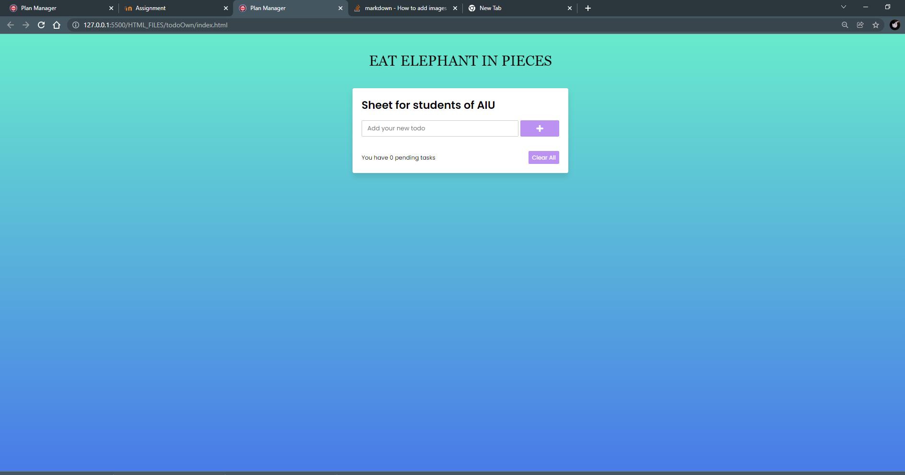

Plan your life ,  eat elephant in pieces , achieve  goals  and your dreams will come true.

 

It saves in local storage that informations which we enter.

# Feedbacks

Nuriza Paishan kyzy: 

        To do planner is the best way to organize your life. To do some notes and write your plans. I have used many planners. But, I liked this to do list. Because, it is easy to use, comfortable and beautiful interface.
Venera:
        
        Wonderful website app. It's very useful for every person, not only for students, to track their affairs. Also I liked this minimalistic style. I definitely recommend this tracker to try
Aibek:
    
        Useful and comfortable website app.  Every person can use by intuition. Not only for students or teachers, for all. I offer to every person who does want to feel what is the APP

[Link to Deploy Docker image with Jenkins to GKE](/htmls)

        
        
        